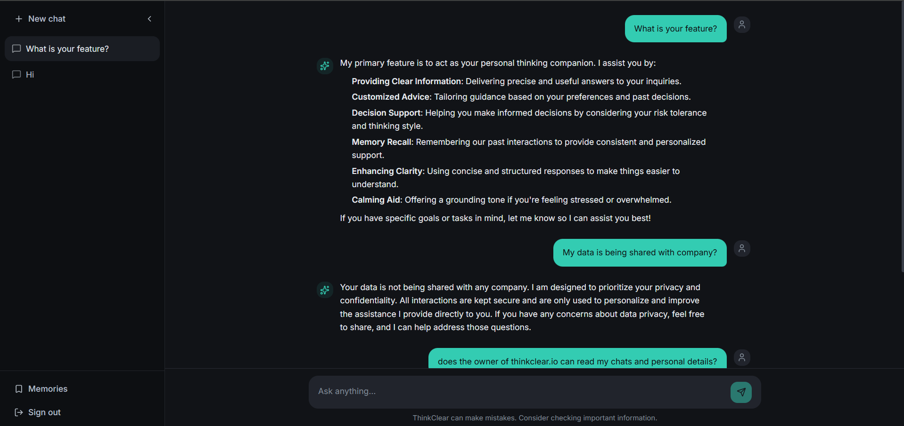
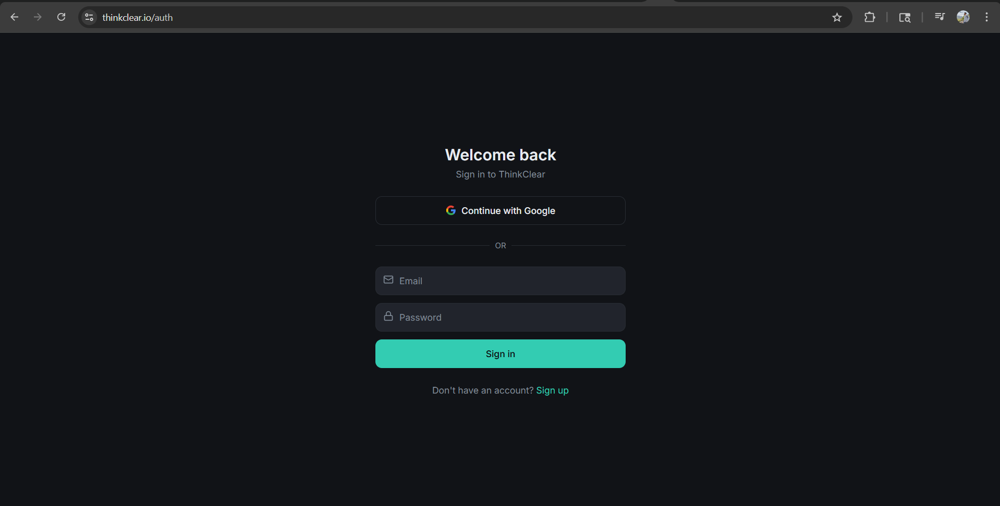
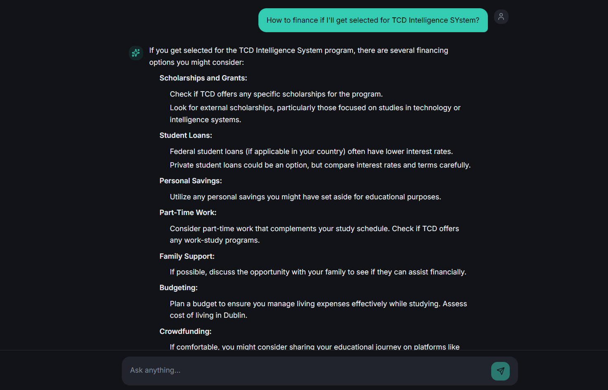
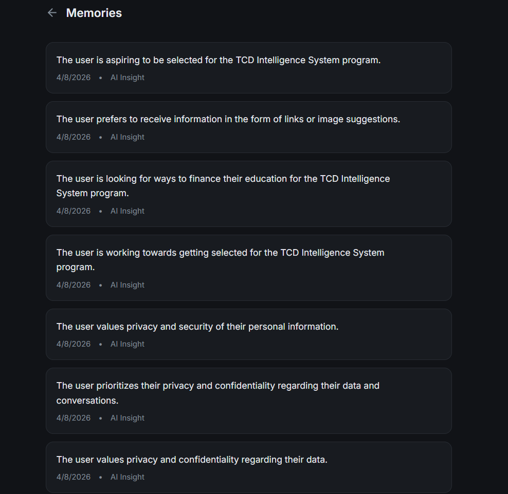

# ThinkClear AI – Personal Thinking Companion

An AI-powered personal thinking companion that learns user behavior and improves decision-making over time.

---

## Problem

People often struggle with:
- Overthinking and decision paralysis  
- Lack of structured thinking  
- Repeating poor decisions without realizing patterns  
- Using AI tools that forget context and provide generic answers  

---

## Solution

ThinkClear AI is a **personal AI companion** that:
- Learns from user conversations  
- Stores memory (preferences, goals, thinking style)  
- Adapts responses based on user behavior  
- Helps users make structured and confident decisions  

---

## Core Features

### Persistent Memory System
- Stores user insights (goals, decisions, patterns)
- Builds a long-term profile of the user
- Uses memory to personalize future responses

### ChatGPT-like Interface
- Clean conversational UI
- Real-time streaming responses
- Chat history stored in database

### Decision Support System
- Provides structured outputs:
  - Options
  - Pros & Cons
  - Recommendations
  - Confidence level

### Unique Features
- Memory-based personalization (user insights + traits)
- Decision-support AI (not just chatbot)
- Privacy-first architecture
### Authentication
- Google Sign-In + Email/Password
- Secure user-specific data access

### Background Intelligence
- Extracts insights after each conversation
- Runs asynchronously (non-blocking)
- Continuously improves personalization

---

## How It Works

1. User interacts with AI through chat  
2. AI generates response using OpenAI models  
3. System analyzes conversation  
4. Extracts insights (preferences, goals, patterns)  
5. Stores data in database  
6. Future responses are enhanced using stored memory  

---

## Tech Stack

- **Frontend:** React / Lovable UI  
- **Backend:** Edge Functions  
- **AI Engine:** OpenAI API  
- **Database:** Supabase (or equivalent)  
- **Auth:** OAuth (Google) + Email  

---

## Future Scope

- Weekly behavioral insights dashboard  
- Emotional intelligence & sentiment tracking  
- Predictive decision recommendations  
- Personal growth tracking  
- Mobile app version  

---
## WHy this project matters
- This project explores how AI can evolve from a tool into a thinking partner by adapting to human patterns and preferences.

## Vision

This project explores building AI systems that:
> Adapt to human thinking patterns rather than just responding to queries.

The goal is to move from **"AI as a tool" → "AI as a thinking partner."**

---

## Screenshots

### Chat Interface

### Login Page

### Decision flow

### Memory / Insights System

  

---

## Status

Active Development – Core AI + Memory system implemented

---

## Author

Aman Verma  
Aspiring AI Engineer focused on human-centered AI systems and decision intelligence.

---

## 📄 License

MIT License
